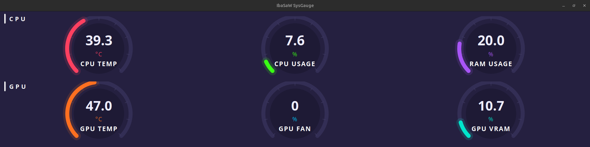
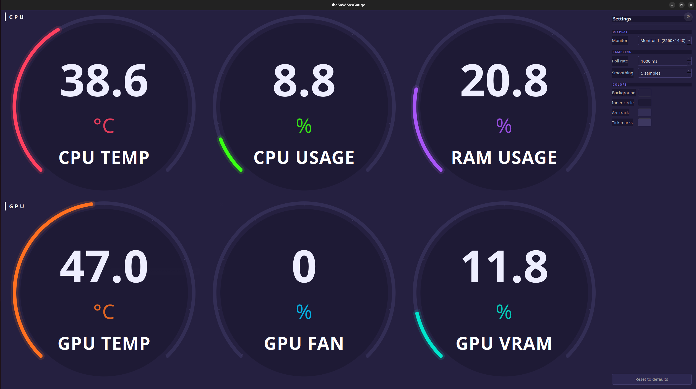

# IbaSaW SysGauge

A hardware monitoring dashboard for Linux — built with PyQt6.

Six circular arc gauges for CPU and GPU metrics, with smooth 60fps animation, a rolling average to stabilise noisy sensor readings, and a live settings sidebar.





## Gauges

| Row | Gauge | Source |
|-----|-------|--------|
| CPU | CPU Temperature | `coretemp / Package id 0` via psutil |
| CPU | CPU Usage % | psutil |
| CPU | RAM Usage % | psutil |
| GPU | GPU Temperature | pynvml (NVML direct — no subprocess) |
| GPU | GPU Fan Speed % | pynvml |
| GPU | GPU VRAM Usage % | pynvml |

## Requirements

- Linux (Python 3.10+)
- `wmctrl` — used for reliable window placement across monitors (installed automatically)
- NVIDIA GPU with drivers installed (for GPU metrics; CPU/RAM gauges work without)

Supported package managers: **apt** (Debian/Ubuntu), **dnf** (Fedora/RHEL), **pacman** (Arch), **zypper** (openSUSE).

## Install

```bash
git clone https://github.com/ibasaw/sysgauge.git
cd sysgauge
bash install.sh
```

The installer will:
1. Detect your distro and check/install system packages — asks for confirmation before installing anything
2. Copy the app package and icon to `~/.local/share/sysgauge/`
3. Create a Python venv and install all Python dependencies
4. Verify all dependencies are working
5. Copy the default config to `~/.config/sysgauge/config.yaml` (only on first install — never overwrites existing config)
6. Register the app in `~/.local/share/applications/` for taskbar icon support
7. Register an autostart entry so the app launches 8 seconds after login
8. Kill any running instance and launch the app immediately

The clone folder is only needed to run the installer. You can delete it afterwards.

## Installed file layout

| Path | What |
|------|------|
| `~/.local/share/sysgauge/sysgauge/` | App package |
| `~/.local/share/sysgauge/assets/` | App icon |
| `~/.local/share/sysgauge/venv/` | Python virtual environment |
| `~/.local/share/icons/hicolor/*/apps/sysgauge.png` | System icon (taskbar) |
| `~/.local/share/applications/sysgauge.desktop` | App entry (taskbar icon) |
| `~/.config/sysgauge/config.yaml` | User configuration (auto-saved by the app) |
| `~/.config/autostart/sysgauge.desktop` | Autostart on login |

## Launch manually

```bash
cd ~/.local/share/sysgauge && venv/bin/python3 -m sysgauge
```

## Settings sidebar

Press **Ctrl+,** or click the **⚙** button (top-right corner) to open the settings sidebar. All changes apply live without restarting.

| Section | Setting | Description |
|---------|---------|-------------|
| Display | Monitor | Which monitor to display on — works with any number of monitors and any orientation |
| Display | Set as default | Save the current monitor as the home monitor for resets |
| Sampling | Poll rate | Sensor poll interval (100ms – 10s) |
| Sampling | Smoothing | Rolling average window size (1–60 samples) |
| Colors | Background | Window background color |
| Colors | Inner circle | Gauge center fill color |
| Colors | Arc track | Unfilled arc track color |
| Colors | Tick marks | Tick mark color |

The **Reset to defaults** button restores all colors and sampling values to factory settings while keeping your saved default monitor.

## Configuration file

`~/.config/sysgauge/config.yaml` is written automatically by the settings sidebar. You can also edit it by hand; changes take effect on next launch.

```yaml
poll_ms:  1000     # sensor poll interval in milliseconds
smooth_n: 5        # rolling average window (number of samples)

bg_color:    "#252040"   # window background
inner_color: "#1e1a35"   # gauge inner circle
track_color: "#332e55"   # arc track (unfilled)
tick_color:  "#3d3860"   # tick marks

# screen_index and default_screen_index are set via the Settings sidebar
```

## Autostart caveat

The autostart entry uses `DISPLAY=:1`. If your display number differs, check with `echo $DISPLAY` and edit `~/.config/autostart/sysgauge.desktop` accordingly.

## Uninstall

```bash
bash uninstall.sh
```

Removes the app, venv, icon, config, and all desktop entries after confirmation.

## Architecture

- **SensorWorker** runs in a `QThread` — all sensor reads are off the main thread
- GPU metrics use **pynvml** (direct NVML calls, <1ms) — never `subprocess nvidia-smi` which causes observer-effect CPU temperature spikes of 10–15°C
- CPU temp and usage are stabilised with a `deque`-based rolling average
- **Config** is reactive: `Config(QObject)` emits a signal on every change, all settings apply live
- Window placement uses **wmctrl** to send `_NET_WM_STATE_MAXIMIZED` directly — works reliably on all monitors regardless of orientation (landscape, portrait, rotated)
- Monitor indices are validated against actual connected screens at startup — safe on any number of monitors
- Single-instance lock via `fcntl.flock` on `$XDG_RUNTIME_DIR/sysgauge.lock`

## License

MIT — see [LICENSE](LICENSE)
