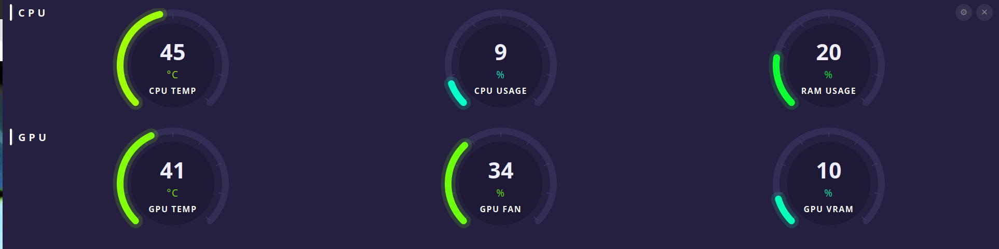
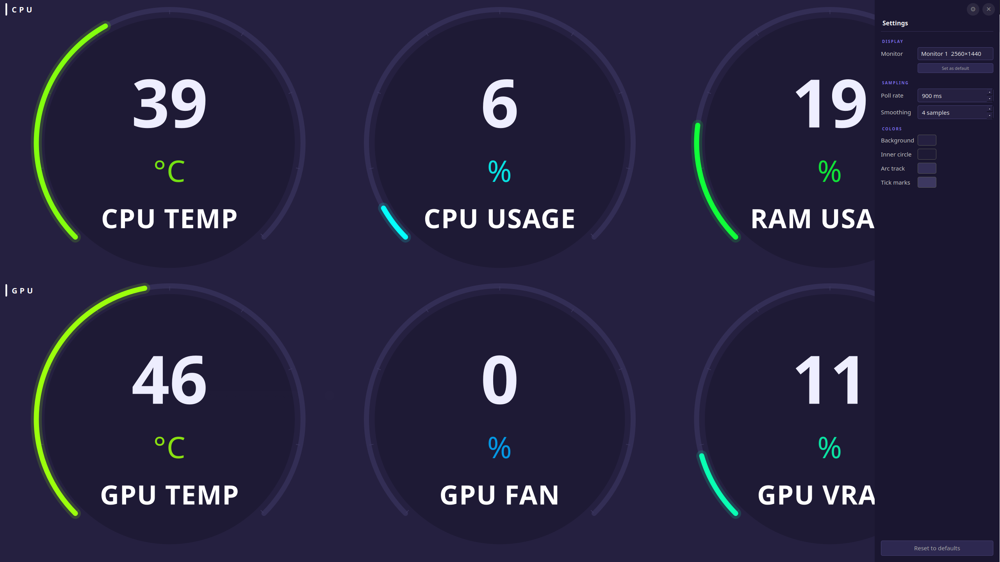

<p align="center">
  
</p>

<p align="center">
  <a href="https://github.com/ibasaw/thermalcanary/actions/workflows/ci.yml"></a>
  
  <a href="LICENSE"></a>
  
  
</p>

The Linux software for dedicated hardware monitoring screens — like AIDA64's sensor panel, but native to your desktop.

6 circular arc gauges (CPU temp, usage, RAM · GPU temp, fan, VRAM) built with PyQt6 and pynvml.
Smooth 60fps animation, rolling average stabilisation, dynamic heat colors. Auto-starts on login.

**Built for dedicated monitoring screens** — works out of the box on stretched panels (1920×480), small IPS monitors, or any secondary display you use as a permanent hardware panel.

> ⚠ **Important** — this is NOT an overlay. Thermal Canary is a fullscreen app intended for a **dedicated monitor**. Don't try to use it as an in-game overlay (use MangoHud for that).

**Fully responsive** — gauges scale to any resolution and orientation: ultrawide, portrait, rotated, compact.

**One-command install** — a single `bash install.sh` sets up everything automatically.

### Dedicated monitoring screen setup

Plug in a secondary screen (a stretched panel, a small IPS monitor, anything), select it in the Settings sidebar under **Monitor**, and click **Set as default**. Thermal Canary will always open on that screen at login — no configuration files to edit.  





## Gauges

| Row | Gauge | Source |
|-----|-------|--------|
| CPU | CPU Temperature | `psutil.sensors_temperatures()` — coretemp/k10temp (configurable) |
| CPU | CPU Usage % | psutil |
| CPU | RAM Usage % | psutil |
| GPU | GPU Temperature | NVIDIA: pynvml · AMD: sysfs hwmon · Intel: xe/i915 sysfs |
| GPU | GPU Fan Speed % | NVIDIA: pynvml · AMD: sysfs hwmon (0% = fans stopped or AMD integrated GPU with no fan) |
| GPU | GPU VRAM Usage % | NVIDIA: pynvml · AMD: sysfs hwmon · Intel: always 0 (not exposed by driver) |

## Requirements

> **Tested and supported on Ubuntu 24.04 LTS.** Other distros (Fedora, Arch, openSUSE) are supported by the installer but have not been formally tested yet. Ubuntu versions below 24.04 may work but are not guaranteed.

The installer checks and installs everything automatically. Here is the full dependency list:

**System packages** (installed automatically via your distro's package manager):

| Dependency | Purpose |
|------------|---------|
| Python 3.10+ | Runtime |
| `python3-venv` | Isolated Python environment |
| `lm-sensors` | Populates `/sys/class/hwmon` for CPU temperature |
| XCB cursor libs (`libxcb-cursor0` / `xcb-util-cursor`) | Required by PyQt6 on X11 |

**NVIDIA driver** — checked separately. The installer prints distro-specific install instructions if the driver is missing. GPU gauges (temperature, fan, VRAM) require the driver for NVIDIA; AMD and Intel GPUs are read via sysfs without any driver installation.

> **GPU backends**: NVIDIA (`pynvml`, direct NVML — no `nvidia-smi` subprocess), AMD (`amdgpu` sysfs hwmon — kernel driver, no extra install), Intel (`xe`/`i915` sysfs hwmon). The backend is auto-detected at startup or can be forced in the Settings sidebar. If no GPU is detected, all three GPU gauges show `—`.

**Python libraries** (installed automatically into a venv):

| Library | Purpose |
|---------|---------|
| `PyQt6` | GUI framework |
| `psutil` | CPU temperature, CPU usage, RAM usage |
| `nvidia-ml-py` (`pynvml`) | GPU metrics via direct NVML calls — no `nvidia-smi` subprocess |
| `PyYAML` | Config file read/write |

Supported package managers: **apt** (Debian/Ubuntu), **dnf** (Fedora/RHEL), **pacman** (Arch), **zypper** (openSUSE).

## Install

```bash
git clone https://github.com/ibasaw/thermalcanary.git
cd thermalcanary
bash install.sh
```

**Thermal Canary runs entirely as your user — no root needed at runtime.**

The installer separates system-package installation from everything else:

- `bash install.sh` — checks system packages and prints any missing ones with the exact `sudo` command to install them, then proceeds with the rootless steps (venv, pip, desktop files, launch)
- `bash install.sh --install-deps` — same, but also invokes `sudo` automatically to install missing packages

The installer will:
1. Check for NVIDIA driver — prints distro-specific install instructions if missing (GPU gauges need it; CPU/RAM gauges work without)
2. Check system packages — prints missing ones or installs them if `--install-deps` was passed
3. Copy the app package and icon to `~/.local/share/thermalcanary/`
4. Create a Python venv and install all Python dependencies (PyQt6, psutil, nvidia-ml-py, PyYAML)
5. Verify all dependencies are working
6. Copy the default config to `~/.config/thermalcanary/config.yaml` (only on first install — never overwrites existing config)
7. Register the app in `~/.local/share/applications/` for taskbar icon support
8. Register an autostart entry so the app launches 8 seconds after login
9. Kill any running instance and launch the app immediately

The clone folder is only needed to run the installer. You can delete it afterwards.

## Installed file layout

| Path | What |
|------|------|
| `~/.local/share/thermalcanary/thermalcanary/` | App package |
| `~/.local/share/thermalcanary/assets/` | App icon |
| `~/.local/share/thermalcanary/venv/` | Python virtual environment |
| `~/.local/share/icons/hicolor/*/apps/thermalcanary.png` | System icon (taskbar) |
| `~/.local/share/applications/thermalcanary.desktop` | App entry (taskbar icon) |
| `~/.config/thermalcanary/config.yaml` | User configuration (auto-saved by the app) |
| `~/.config/autostart/thermalcanary.desktop` | Autostart on login |

## Launch manually

```bash
cd ~/.local/share/thermalcanary && venv/bin/python3 -m thermalcanary
```

## Settings sidebar

Two buttons sit in the top-right corner: **⚙** opens the settings sidebar, **✕** closes the app (with confirmation). Press **Ctrl+,** to toggle the sidebar from the keyboard. All changes apply live without restarting.

| Section | Setting | Description |
|---------|---------|-------------|
| Display | Monitor | Which monitor to display on — works with any number of monitors and any orientation |
| Display | Set as default | Save the current monitor as the startup monitor — the app always opens here on launch |
| Sampling | Poll rate | Sensor poll interval (100ms – 10s) |
| Sampling | Smoothing | Rolling average window size (1–60 samples) |
| Colors | Background | Window background color |
| Colors | Inner circle | Gauge center fill color |
| Colors | Arc track | Unfilled arc track color |
| Colors | Tick marks | Tick mark color |

The **Reset to defaults** button restores all colors and sampling values to factory settings while keeping your saved default monitor.

## Configuration file

`~/.config/thermalcanary/config.yaml` is written automatically by the settings sidebar. You can also edit it by hand; changes take effect on next launch.

```yaml
poll_ms:  1000     # sensor poll interval in milliseconds
smooth_n: 5        # rolling average window (number of samples)

bg_color:    "#252040"   # window background
inner_color: "#1e1a35"   # gauge inner circle
track_color: "#332e55"   # arc track (unfilled)
tick_color:  "#3d3860"   # tick marks

# screen_index and default_screen_index are set via the Settings sidebar
```

## Autostart caveat

The autostart entry inherits `$DISPLAY` from the login session, falling back to `:0`. If the app doesn't start on login, check your display number with `echo $DISPLAY` and edit `~/.config/autostart/thermalcanary.desktop` accordingly.

## Uninstall

```bash
bash uninstall.sh
```

Removes the app, venv, icon, config, and all desktop entries after confirmation.

## Architecture

- **SensorWorker** runs in a `QThread` — all sensor reads are off the main thread
- GPU metrics use **pynvml** (direct NVML calls, <1ms) — never `subprocess nvidia-smi` which causes observer-effect CPU temperature spikes of 10–15°C
- CPU temp and usage are stabilised with a `deque`-based rolling average
- **Config** is reactive: `Config(QObject)` emits a signal on every change, all settings apply live
- Window runs **fullscreen** (`showFullScreen`) — no title bar, fills the entire monitor. This bypasses Mutter's `WM_NORMAL_HINTS` enforcement which otherwise clamps window geometry to `minimumSizeHint`, making maximize unreliable on short or rotated monitors
- Monitor switching uses an event-driven state machine: `showNormal()` → wait for `WindowStateChange` (Mutter ack) → `windowHandle().setScreen()` + `setGeometry()` → 50ms → `showFullScreen()`. `wmctrl` is called once after first show to set `_NET_WM_STATE_SKIP_TASKBAR/SKIP_PAGER` (hides the window from GNOME Dash without using `Qt.WindowType.Tool`, which would break cross-monitor placement on Mutter)
- Monitor indices are validated against actual connected screens at startup — safe on any number of monitors
- Single-instance lock via `fcntl.flock` on `$XDG_RUNTIME_DIR/thermalcanary.lock`
- Runs entirely as the logged-in user — no root required at runtime

## License

MIT — see [LICENSE](LICENSE)
